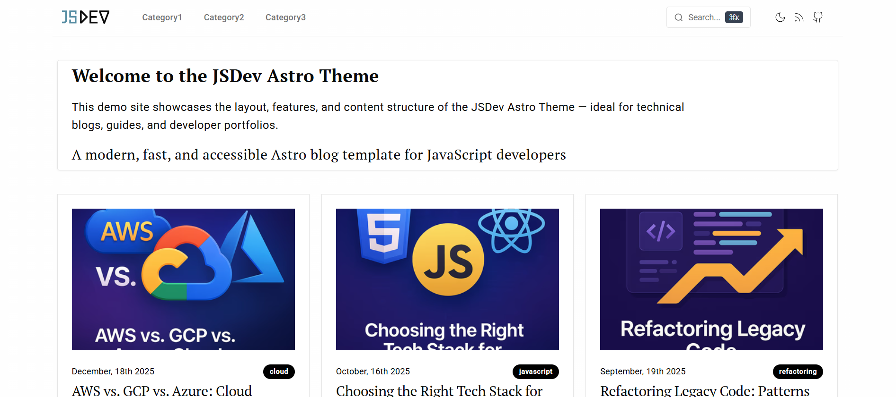

# 🚀 JSdev Astro Theme

> A clean, minimal Astro + TypeScript blog theme with MDX support. Built for fast, SEO-ready publishing.

This is the template behind [JSDev.Space](https://jsdev.space) — open-source and ready to deploy.



---

## ✨ Features

- ⚡️ **Astro-Powered**: Static rendering for performance
- 🎨 **Minimal Design**: Clean layout with dark/light theme
- 📱 **Responsive**: Mobile-first experience
- 📝 **MDX Support**: Custom blog posts with embedded components
- 🔍 **Built-in Search**: Fast, keyboard-accessible search
- 🧠 **SEO Ready**: Meta tags, OpenGraph, robots.txt, RSS
- 🗂 **Organized Structure**: Pages, layouts, and styles separated cleanly

---

## 📁 Project Structure

```
src/
├── app/              # Layouts, styles, config
├── components/       # UI elements
├── content/          # Blog posts (MDX)
├── pages/            # Static pages
├── shared/           # Helpers, types, categories
```

---

## 🔧 Customization

### Site Settings

Edit metadata and default images in:

```
src/app/config/site.ts
```

### Blog Posts

Add your posts in:

```
src/content/blog/*.mdx
```

Use this frontmatter:

```mdx
---
title: 'My Blog Post'
description: 'Short SEO description'
date: '2025-08-03'
tags: ['astro', 'javascript']
image: '/icon.png'
---
```

### Categories

Edit tags and category metadata in:

```
src/shared/config/category.helpers.ts
```

---

## 🧪 Run Locally

```bash
npm install
npm dev
```

Build for production:

```bash
npm build
```

---

## 🌐 Deployment

- Netlify (`netlify.toml` ready)
- Vercel
- Cloudflare Pages

Deploy the `dist/` directory.

---

## 📄 License

MIT — by [jsdev.space](https://jsdev.space)

---

## 🔍 Search & Pagination

### Search

The theme includes a fast, keyboard-accessible search feature with fuzzy matching. Trigger it with:

```
Cmd/Ctrl + K
```

You can search across all blog posts and filter results live.  
Make sure to adjust collection names in:

```
src/components/search/lib/utils.ts
src/components/search/ui/search.astro
```

Replace old references like `howtos`, `snippets`, `fridays` with your actual collections:  
E.g., `articles`, `guides`, `notes`.

---

### Pagination

Pagination is built-in for:

- Home `/blog/`
- Tag pages `/blog/tags/[tag]/`

Pages are generated statically, e.g.:

```
/blog/
/blog/2/
/blog/tags/astro/
/blog/tags/astro/2/
```

You can control how many posts appear per page by editing the pagination logic in:

```
src/pages/[slug].astro
src/pages/tags/[tag]/[...page].astro
```
