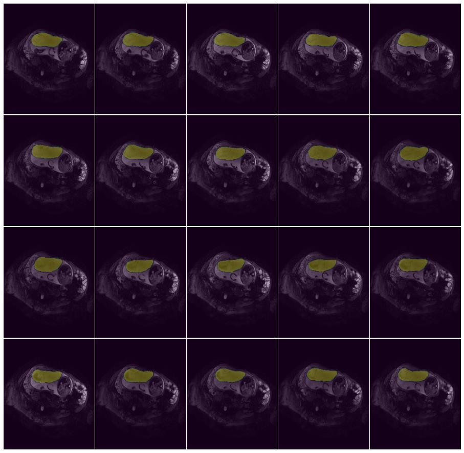
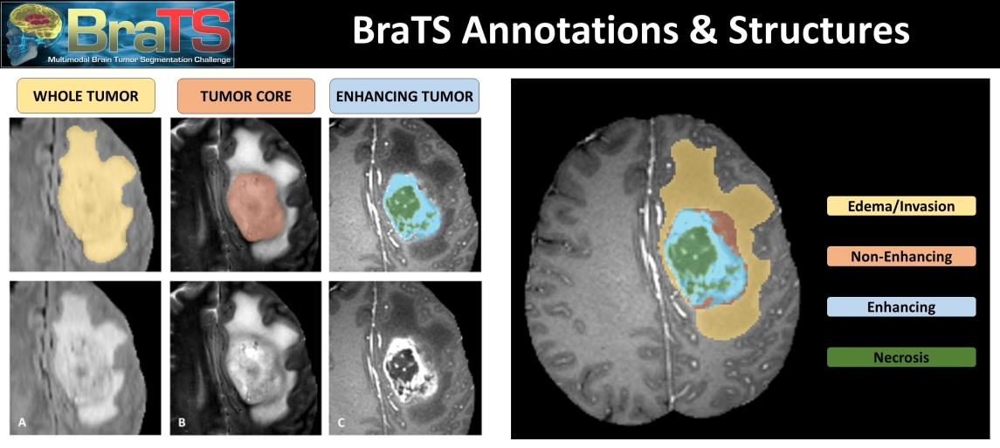
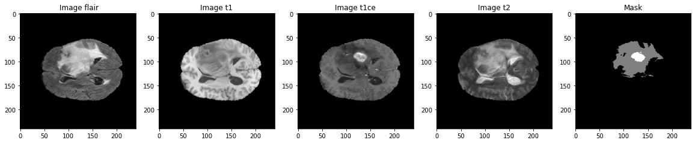
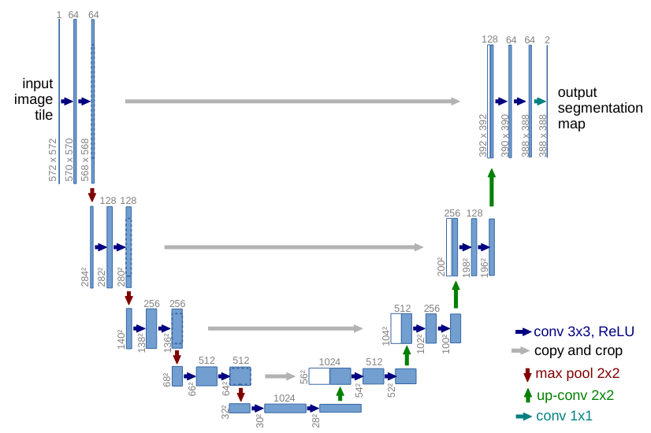
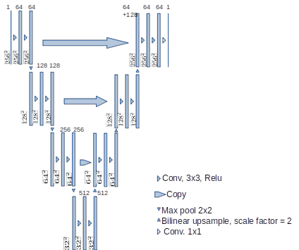

# Automatic Medical Image Segmentation with U-Net and U-Net++

## Project Overview

This dissertation project focuses on the automatic segmentation of medical images using advanced deep learning architectures, specifically **U-Net** and **U-Net++**. The primary datasets employed are the **Placenta dataset** from the University of Nottingham and the **BraTS (Brain Tumor Segmentation)** dataset. The goal is to enhance the accuracy and efficiency of medical image segmentation, a critical task traditionally performed manually by radiologists.

## Abstract

Medical MRI image segmentation is a vital process for quantifying pathology. Historically, this has been a manual, time-consuming task. Building upon a successful U-Net solution from the University of Nottingham, this work benchmarks the original U-Net and introduces **U-Net++** to improve segmentation results. The project demonstrates the effectiveness of these models on the unique placenta dataset, achieving promising performance. The training utilized the **Adam Optimizer** and a hybrid **Dice + Binary Cross-Entropy (BCE) loss** function. U-Net++ was also tested with deep supervision and model pruning to evaluate the trade-off between inference speed and predictive accuracy.

**Key Results (Placenta Dataset):**
- **U-Net Dice Score:** 0.90 [0.85, 0.95]
- **U-Net++ Dice Score:** 0.92 [0.89, 0.93]

The models were trained and tested on a **NVIDIA 2080TI GPU** running Red Hat Linux. The complete implementation code is available in the [GitHub Repository](#).

## Introduction

Semantic segmentation in the medical field is crucial for identifying and quantifying pathological regions. Manual segmentation is often inefficient and prone to inter-observer variability. This project leverages deep learning to automate this process, enabling faster and more consistent analysis of medical images. The focus is on two key datasets: the unique **Placenta dataset** from the University of Nottingham and the widely recognized **BraTS dataset** for brain tumor segmentation.

## Datasets

### Placenta Dataset

The Placenta dataset comprises **21 3D MRI images**. This dataset is unique to the University of Nottingham and is essential for studying fetal pathology through placental analysis. The scarcity of data presents a significant challenge, making robust model performance critical.

### BraTS Dataset

The BraTS dataset is a well-established benchmark for brain tumor segmentation. It consists of multimodal 3D MRI scans (T1, T1ce, T2, FLAIR) from patients with gliomas. The dataset provides expert-annotated labels for different tumor sub-regions (e.g., necrotic core, edema, enhancing tumor).

## Methodology

### U-Net Architecture
 

U-Net is a convolutional neural network (CNN) specifically designed for biomedical image segmentation. Its architecture features a **contracting path** (encoder) to capture contextual information and a **symmetric expanding path** (decoder) for precise localization. A key feature is the use of **skip connections** that concatenate high-resolution features from the encoder to the corresponding layers in the decoder, allowing the network to learn both context and fine-grained details.

### U-Net++ Architecture

U-Net++ builds upon the original U-Net by introducing **dense skip pathways** and **deep supervision**. The dense connections create a nested, fully connected U-Net structure, enhancing feature propagation and reducing the semantic gap between the encoder and decoder. Deep supervision allows for the training of multiple auxiliary segmentation heads at different depths, improving gradient flow and enabling the model to make more accurate predictions.

## Results

### Performance Metrics

| Model       | Dataset       | Dice Score       |
|-------------|---------------|------------------|
| U-Net       | Placenta      | 0.90 [0.85, 0.95]|
| U-Net++     | Placenta      | **0.92 [0.89, 0.93]** |
| U-Net       | BraTS         | Lower than SOTA  |
| U-Net++     | BraTS         | Lower than SOTA  |

### Comparison with Previous Work

The results on the **Placenta dataset surpassed previous benchmarks** at the University of Nottingham, demonstrating the effectiveness of both U-Net and U-Net++ in this specific context. The improvement with U-Net++ highlights the benefit of its dense connections and deep supervision for this task. In contrast, the results on the **BraTS dataset were lower than competitive benchmarks**, indicating the challenges associated with its complexity and the need for more sophisticated techniques or larger-scale training.

## Conclusion

The implementation of U-Net and U-Net++ demonstrated **promising results**, particularly on the Placenta dataset, where the models outperformed prior studies. This project underscores the significant potential of deep learning in automating medical image segmentation. However, the performance on the BraTS dataset reveals limitations, emphasizing the need for further research into more advanced architectures and training strategies.

## Future Work

Future research directions include:
*   Exploring alternative **loss functions** (e.g., Focal Loss, Tversky Loss) and **network architectures** (e.g., Transformers).
*   Investigating the impact of advanced **data augmentation** and **preprocessing** techniques.
*   Expanding the study to include **larger datasets** or additional imaging modalities.
*   Implementing **semi-automated** systems that combine AI predictions with radiologist input to improve overall segmentation accuracy.

For further details and code access, please visit the [GitHub Repository](https://github.com/manueltechlabs/dissertation).   