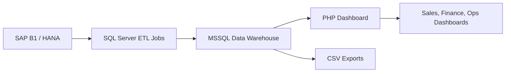

# ERP Data Integration & Analytics Platform

## Overview

Built and maintained a secure, company-wide reporting system that unified financial and operational data from SAP Business One and HANA into a centralized MSSQL data warehouse. Designed and automated ETL pipelines using SQL Server Agent jobs and stored procedures to synchronize data on both scheduled and event-driven triggers (e.g., period-end closure). 

Implemented role-based access control (RBAC) to enforce data visibility by team—enabling tailored dashboards for finance, sales, operations, and executive leadership. Developed interactive frontend interfaces using PHP, HTML, and CSS to visualize KPIs including liquidity ratios, inventory turnover, OTD, and OTIF.

The system empowered data-driven decision-making across departments with actionable reports on sales performance, collections efficiency, and supply chain logistics. Data was securely exported in structured CSV formats for integration with downstream systems (e.g., HR), ensuring consistency, auditability, and operational efficiency.

- **Problem Solved**: Eliminated performance degradation in production by offloading reporting to a dedicated analytics environment.
- **Architecture**: Source → ETL (MSSQL Jobs) → Data Warehouse → Reporting Layer (PHP/HTML)
- **Security**: RBAC model with group-based privilege inheritance (UI + backend enforcement)
- **Automation**: Scheduled and manual-triggered pipelines for data refresh and period-close workflows
- **Impact**: Enabled real-time visibility into KPIs and supported compensation workflows without exposing sensitive logic 

## Architecture

Source → ETL (SQL Server Agent Jobs & Stored Procedures) → Data Warehouse → PHP Dashboard Layer

## Key Features

ETL Automation: Scheduled and event-triggered pipelines for real-time sync
Role-Based Access (RBAC): Secure data visibility by team (finance, sales, ops)
KPI Dashboards: Visualized liquidity ratios, inventory turnover, OTD, OTIF
HR Integration: CSV exports for compensation workflows

## Impact

- Offloaded reporting from production, improving system performance
- Enabled data-driven decisions across departments
- Supported incentive models with automated, auditable calculations

