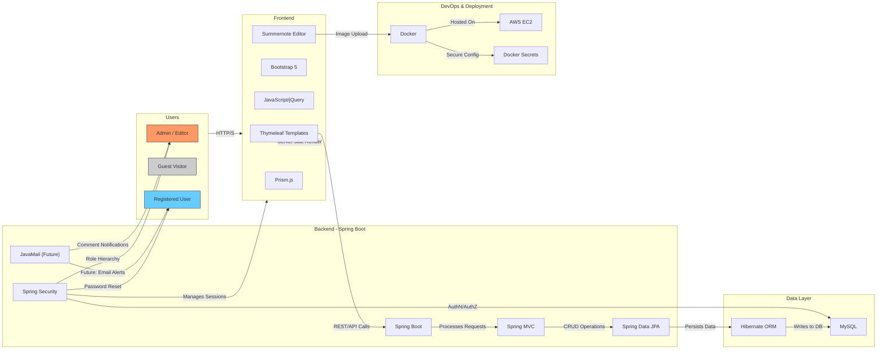

# Production-Ready Blogging Platform (Spring Boot, AWS, Docker)

## 🌐 Live Demo
[View Live Project](https://bytebounty.com) 

## GitHub Repository
[GitHub - Java Blog Project](https://github.com/manueltechlabs/java-blog-project)

## Overview
Designed and deployed a full-stack content platform with secure authentication, role-based access control, and cloud-native deployment.

Built with Spring Boot and containerized using Docker, the system includes user management, content workflows, and production-grade security practices (Spring Security, password handling, CSRF protection).

Deployed on AWS EC2 with environment-based configuration and secure secret management.

---

## Key Features

### ✅ Dynamic Blog System
- Paginated blog post grid with thumbnails, titles, dates, categories, and tags.
- Clean URL routing using **post slugs** (e.g., `/blog/java-spring-boot-intro`).
- Full-text post view with syntax-highlighted code blocks and embedded media.
- Filter posts by **category** or **tag** via interactive UI.

### User Engagement
- Comment system allowing:
  - Registered users to comment after login.
  - Guests to comment with name and email.
- Reply functionality for threaded discussions.
- Edit and delete own comments (with session validation).
- Admin moderation capabilities.

### Secure Authentication
- Role-based access control: **Admin, Editor, Author, Subscriber**.
- Hierarchical permissions (e.g., Admin inherits all lower roles).
- Login, logout, registration, and "Remember Me" functionality.
- "Forgot Password" flow with email reset token.
- Custom `LoginSuccessHandler` to track last login time.

### User Profiles
- Edit personal information (name, bio, social links).
- Upload and manage profile picture.
- View own posts and comments.

### 🖋️ Rich Content Management
- WYSIWYG editor (**Summernote**) for creating and editing blog posts.
- Support for:
  - Text formatting (bold, italic, lists, headings).
  - Image uploads with server-side storage.
  - Code block embedding with **Prism.js** highlighting.
- Draft saving and scheduled publishing.

### 🛠️ Admin Dashboard
- Full CRUD operations for blog posts.
- User management: view, edit roles, disable accounts.
- Comment moderation: approve, edit, delete.
- Real-time activity monitoring.

---

## 🏗️ Architecture & Technologies



### 🖥️ Frontend
| Technology       | Purpose |
|------------------|--------|
| Thymeleaf        | Server-side HTML templating |
| Bootstrap 5      | Responsive UI framework |
| JavaScript/jQuery| DOM manipulation & interactivity |
| Summernote       | Rich text editor |
| Prism.js         | Code syntax highlighting |


### ⚙️ Backend
| Technology         | Purpose |
|--------------------|--------|
| Java 17            | Core language |
| Spring Boot        | Web framework & dependency injection |
| Spring MVC         | REST and form handling |
| Spring Data JPA    | ORM & database interaction |
| Spring Security    | Authentication & authorization |
| MySQL              | Relational database |
| BCrypt             | Password hashing |

### ☁️ Deployment & DevOps
| Technology       | Purpose |
|------------------|--------|
| Docker           | Containerization |
| AWS EC2          | Cloud hosting |
| Docker Secrets   | Secure credential management |

---

## UI/UX Design
Leveraged premium-quality templates from [HTMLCodex.com](https://htmlcodex.com):
- **FreeFolio** – For the personal portfolio layout.
- **Bloggy** – For blog structure and styling.

These templates were customized to ensure visual consistency across the static portfolio and dynamic blog, creating a seamless user experience.

---

## 🧩 Challenges & Solutions

| Challenge | Solution |
|--------|--------|
| Summernote image upload conflicts | Implemented custom file upload handler with UUID-named files and session-safe deletion logic |
| Role hierarchy in Spring Security | Used `RoleHierarchyImpl` to define parent-child role relationships |
| CSRF protection with Thymeleaf forms | Integrated `th:action` with Spring’s CSRF token auto-inclusion |
| Secure credential storage | Used Docker secrets mounted as files, not environment variables |

---

## Future Improvements
- Email notifications for new comments (via JavaMail).
- Newsletter subscription system with confirmation workflow.
- CI/CD pipeline using GitHub Actions.
- Orchestration with Docker Swarm or Kubernetes.
- Admin dashboard SPA using React/Vue for better UX.

---

## Project Structure (Simplified)

```
src/
├── main/
│   ├── java/com/example/blog/
│   │   ├── controller/
│   │   ├── model/
│   │   ├── repository/
│   │   ├── service/
│   │   └── security/
│   └── resources/
│       ├── templates/
│       ├── static/
│       └── application.yml
└── Dockerfile   
```


---

## How to Run Locally
1. Clone the repository:
   ```bash
   git clone https://github.com/yourusername/java-blog-project.git

Set up MySQL database and update application.yml.
Build with Maven:
./mvnw clean package

Run with Docker:
docker build -t java-blog .
docker run -p 8080:8080 java-blog

Access at http://localhost:8080

## Conclusion
This project demonstrates my ability to design and implement a secure, scalable, and maintainable full-stack web application using enterprise-grade Java technologies. It blends professional frontend design with robust backend logic, showcasing skills in authentication, database modeling, API design, deployment, and UX optimization — all essential for modern web development.

Ideal for developers seeking to build content-driven platforms with Java, this architecture serves as a strong foundation for blogs, CMS, or enterprise dashboards.


---