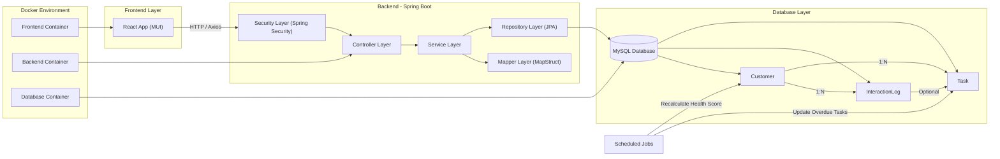
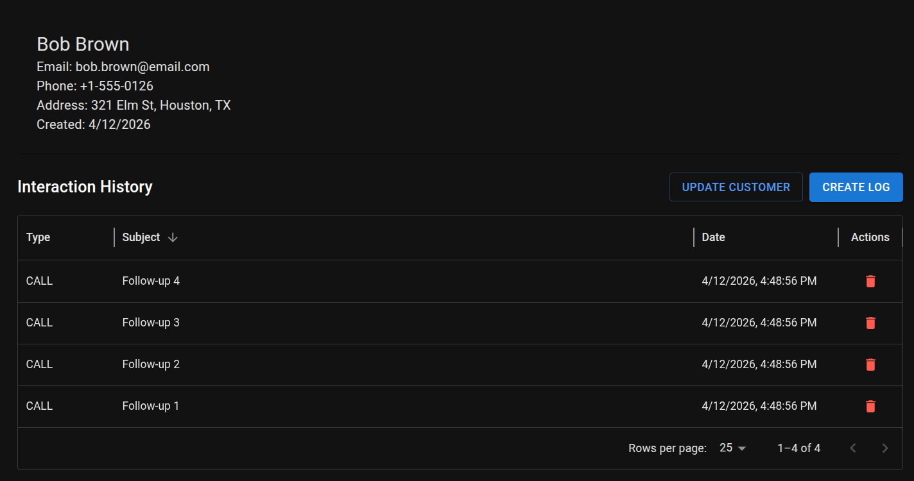
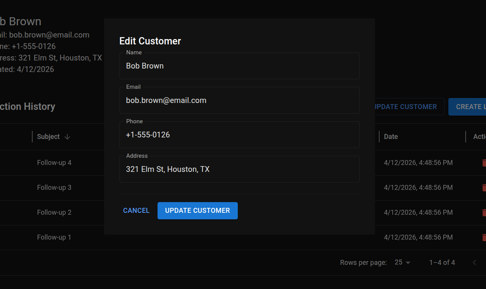
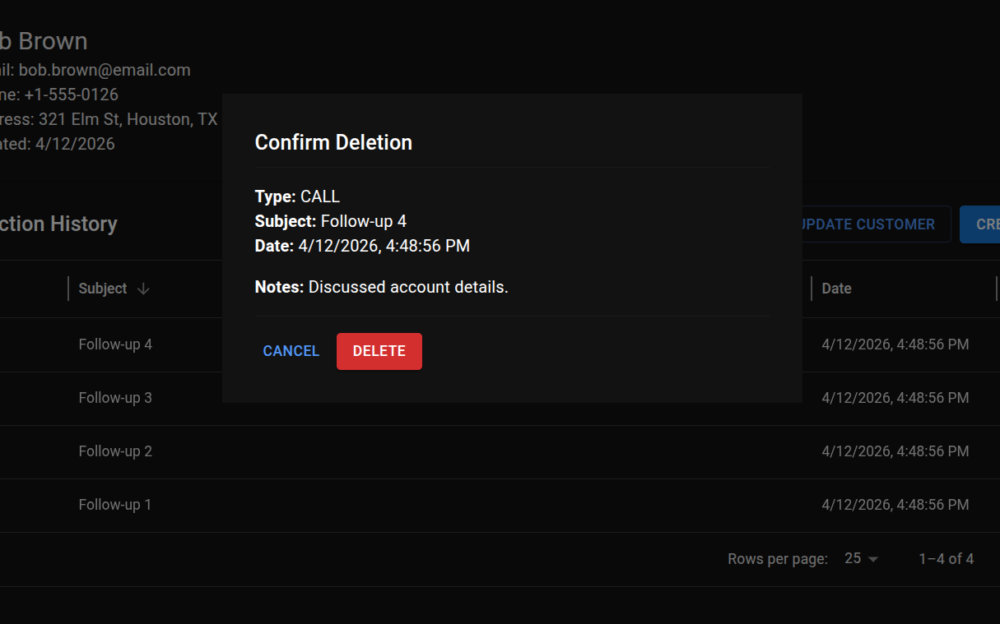
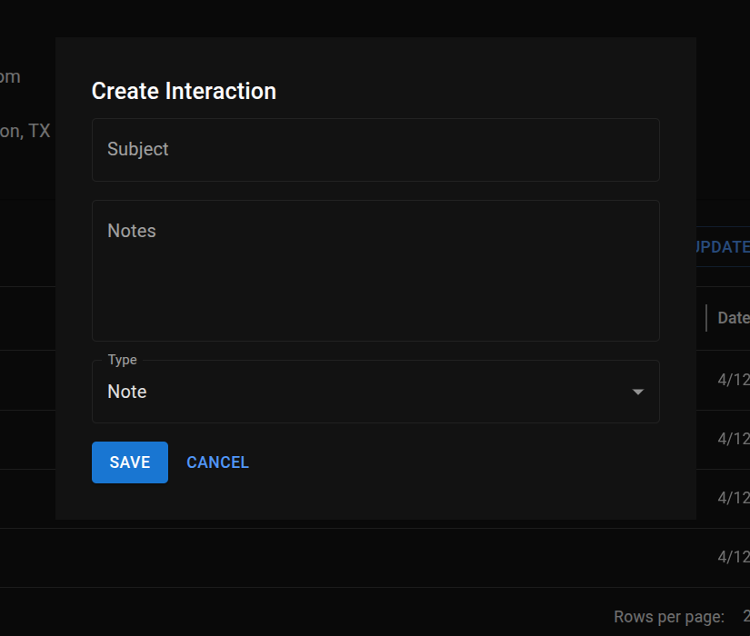

## Full-stack CRM system built with Spring Boot, React, and Docker

## 🌐 Live Demo
[View Live Project]() 

## GitHub Repository
[GitHub - Full-stack CRM system](https://github.com/manueltechlabs/SimpleCRM)

### 🚀 Project Overview

**SimpleCRM** is a lightweight yet extensible Customer Relationship Management system designed to track customer data, interactions, and follow-up tasks in a clean, structured way.

The project focuses on **clarity, scalability, and real-world usability**, starting with a solid foundation and evolving toward more advanced CRM capabilities such as analytics, automation, and integrations.

Although currently implemented as a **functional base version**, the architecture is intentionally designed to support future enhancements.

---
### 🛠️ Technology Stack

#### **Backend**

* Java 21
* Spring Boot (Web, Data JPA, Security)
* REST API architecture
* MapStruct (DTO mapping)
* Lombok

#### **Frontend**

* React
* Material UI (MUI)
* Axios

#### **Database**

* MySQL
* JPA / Hibernate

#### **DevOps & Infrastructure**

* Docker
* Docker Compose (multi-container setup)

#### **Architecture**

* Layered architecture (Controller → Service → Repository)
* Scheduled background jobs
* Scalable, containerized system design
---
### System diagram (Current implementation + planned architecture)

---

### 🧠 Core Concept

At its heart, SimpleCRM revolves around three core entities:

* **Customers** — who you work with
* **Interactions** — how you communicate
* **Tasks** — what needs to be done

This structure reflects real business workflows, making the system both practical and intuitive.

---

### 🗂️ Data Model

The backend is built around a relational schema with three main tables:

#### Customer

Stores essential contact and identification details:

* Name, email, phone, address
* Creation timestamp
* Acts as the central entity

#### Interaction Log

Tracks all communication history:

* Calls, emails, meetings, notes
* Linked to a specific customer
* Includes summaries and detailed notes

#### Task

Manages follow-ups and action items:

* Deadlines, priority levels, and status
* Can be linked to customers and/or interactions
* Supports lifecycle states: `OPEN`, `COMPLETED`, `OVERDUE`

---

### ⚙️ Backend Design

The backend exposes a clean REST API that enables full CRUD operations and business-specific queries.

#### Key Capabilities

* Customer management (create, update, delete, view)
* Interaction tracking per customer
* Task management with filtering (status, priority, deadlines)
* Derived insights such as:

  * Overdue tasks
  * Upcoming deadlines
  * Customers needing attention

#### Data Integrity & Safety

* **No cascade delete** → protects historical interaction data
* Controlled persistence using:

  * `PERSIST` (create)
  * `MERGE` (update)

---

### ⏱️ Automation & Background Processing

The system includes logic for handling time-based behavior:

* Tasks automatically become **OVERDUE** based on deadlines
* Implemented via scheduled background jobs
* Ensures the database reflects real-world time progression

---

### 📊 Customer Health Scoring

A key planned feature is a **Customer Health Score**, designed to prioritize engagement:

**Factors include:**

* Interaction frequency
* Recency of communication
* Interaction quality (meeting > call > email > note)
* Task completion status

**Outcome:**

* 🟢 Healthy
* 🟡 At risk
* 🔴 Needs attention

This enables smarter decision-making and proactive follow-ups.

---

### 🧩 Frontend Architecture
#### Customer View

#### Edit Customer

#### Confirm Deletion

#### Create Interaction

Built with a modern React-based stack:

* **React + Material UI (MUI)** for a polished interface
* **React Router** for navigation
* **Axios** for API communication

#### UI Structure

**Master–Detail Layout:**

* Left / main section → Customer overview
* Right / detail section → Interactions and activity

#### Features

* Searchable customer navigation
* DataGrid for interaction history
* Modal-based workflows (create/view logs)
* Clean, component-driven design

---

### 📅 Timeline Visualization (Planned)

A future enhancement introduces a **unified activity timeline**:

Instead of separate tables, users see a chronological story:

* Customer created
* Emails sent
* Calls logged
* Tasks created / overdue

This improves usability and aligns with how users naturally think about customer relationships.

---

### 🔮 Future Enhancements

The project roadmap includes features commonly found in production-grade systems:

* Authentication & role-based access (JWT/OAuth2)
* Soft deletes with recovery
* Pagination & filtering for scalability
* Export functionality (CSV/PDF)
* Error handling with UI notifications
* DTO mapping for clean architecture
* Global exception handling
* ERP integrations (e.g., SAP, Dynamics)
* Audit logging
* Machine learning for customer risk scoring

---

### 🏗️ Design Philosophy

SimpleCRM is built with:

* **Separation of concerns** (clean backend/frontend boundaries)
* **Extensibility** (easy to add features without refactoring core logic)
* **Real-world alignment** (mirrors actual CRM workflows)
* **Data safety** (no accidental data loss)

---

### 📌 Current Status

✅ Core system implemented and functional
🚧 Advanced features in planning / partial implementation

This project serves both as:

* A working CRM foundation
* A blueprint for a more advanced, production-ready system

---

### 💡 Key Takeaway

SimpleCRM demonstrates how a **minimal system can evolve into a powerful platform** by starting with strong fundamentals and layering in intelligent features over time.
