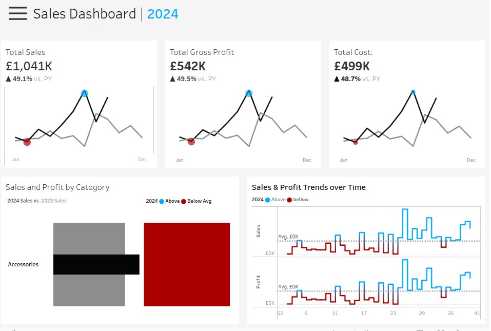
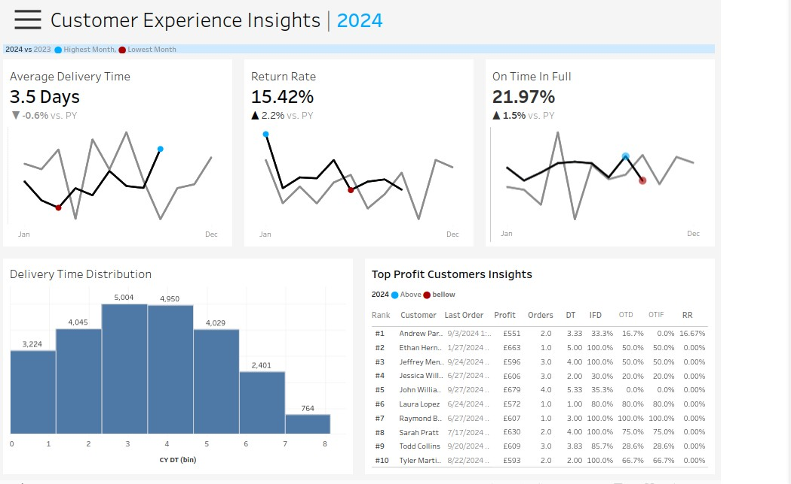
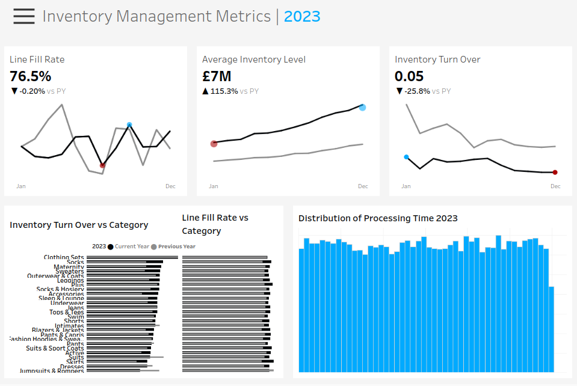

# TheLook eCommerce: Interactive Performance Dashboards
This project presents a suite of four interactive Tableau dashboards built to visualize key performance metrics for The Look eCommerce, a synthetic dataset by Google’s Looker team. Designed as a companion to a Python/SQL analysis, these dashboards transform complex operational data into intuitive, actionable insights for business stakeholders.
---
## Dashboard Overview
### Sales Metrics Dashboard

- Tracks total sales, gross profit, and cost trends over time
- Compares performance across product categories
- Highlights seasonal peaks (notably December) and growth trajectories (e.g., Jeans sales up from $4.7K to $130.8K, 2019–2024)
### Customer Metrics Dashboard

- Monitors delivery time, return rate, and On-Time-In-Full (OTIF) fulfillment
- Visualizes delivery time distribution and top-profit customers
- Reveals stable service levels (0.755–0.768) with increasing consistency (std dev ↓ from 0.05 to 0.01)
### Marketing Metrics Dashboard

- Displays total sessions, conversion funnel (cart → purchase), and traffic sources
- Shows conversion rate growth from 0.09% (2019) to 8.25% (2023)
- Highlights cart abandonment risk: 26.7% of users cancel after adding to cart
### Inventory Management Dashboard

- Tracks inventory turnover, line fill rate, and processing time
- Compares performance across categories and distribution centers
- Identifies opportunities for stock optimization in high-growth segments
---
## Design & Impact
Each dashboard is interactive, filterable by time, category, and region, enabling drill-down exploration. Clean layouts, consistent color schemes, and clear labeling ensure accessibility for non-technical users.

The dashboards support strategic decision-making by:

- Highlighting seasonal demand patterns for targeted campaigns
- Exposing checkout friction points to reduce cart abandonment
- Monitoring supply chain reliability to improve fulfillment
- Visualizing category-level profitability for inventory planning 

Linked to the Colab-based analytical backend, this project bridges deep data analysis with executive-ready visualization—demonstrating end-to-end data storytelling and business impact.